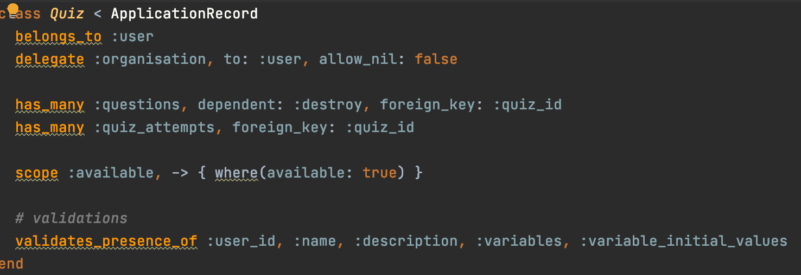

<p align="center">
  <br>
</p>

<p align="center">
  <a href="#project-goals-and-motivation">Introduction & Motivation</a> •
  <a href="#key-features">Key Features</a> •
  <a href="#how-to-use">How To Use</a> •
  <a href="#installation">Installation</a> •
  <a href="#api-reference">API Reference</a> •
  <a href="#credit-and-licence">Credit and Licence</a> •
  <br>
</p>

## Project Goals and Motivation

The Scenario Platform is a too which facilitates the creation and taking of interactive scenarios with added
complexities such as concurrent variables and branching paths for a more in-depth experience.

This project is created by the [Legal Innovation Lab Wales](https://legaltech.wales/) for purposes of creating a
platform for charities/organisations to easily create interactive scenarios to simulate real world experiences. Such as
client interviews, conversation monitoring and life scenarios.

## Key Features

* Non-linear Questions

<br>

The Scenario Platform supports a non-linear question structure which can be used to create and simulate scenarios that
are more directly in line with real world conversation. Individual answers can be linked to arbitrary questions to allow
diverging pathways, and a more complex flow. Allowing users to have a more interactive experience.

* Extensive variable customisation

<br>

Each scenario can have a range of variables, each answer can influence one or many of these. These variables are fully
customisable to each individual scenario. Allowing monitoring of different areas such as compliance, understanding and
trust behind the scenes. This as a result can lead to scenarios showcasing users strengths and weaknesses in a variety
of areas based on their answers.

## Tech Stack & Requirements

The core technologies used for this project are:

* Ruby (2.7.2) (we recommend using rbenv for managing Ruby versions)
* Rails (6.1.0)
* Webpacker (4.3.0)
* PostgreSQL (~12.6)
* NodeJS (~10.19)


* React. 17.0.1, React router & Bootstrap for styling the front end components

* HTML, CSS + JS. All HTML, CSS and JS

## How to use

You can visit the project at [https://scenario-platform.legaltech.wales/](https://scenario-platform.legaltech.wales/) and read the guide on [building scenarios](https://scenario-platform.legaltech.wales/guide). Please contact the team if you have any questions.

## Local Installation

### Install dependencies
<details>
<summary>Some additional dependency steps might include:</summary>

#### Postgres

```zsh
sudo apt install postgresql postgresql-contrib`
sudo apt install libpq-dev
```
Setup postgres local db

#### Node

```zsh
sudo apt install nodejs
sudo apt install npm
sudo npm install -g npm@latest
sudo npm install --global yarn
```
</details>

Install Gems

`bundle`

Install Webpack

`rails webpacker:install`

Create the database and run migrations:

```zsh
rails db:create
rails db:migrate
rails db:seed
```

### Run the application

`rails s`

You should now be able to view the main web page at

``http://localhost:3000``

### Other Potential Fixes


You might be asked to override your local webpacker environment to work

```javascript
config/webpack/environment.js
```

## API Reference

Coming soon

## Tests

Coming soon

## Credits and licence

[MIT License](https://github.com/Legal-Innovation-Lab-Wales/quiz-builder/blob/add-license-1/LICENSE)

[Legal Innovation Lab Wales](https://legaltech.wales/) 
