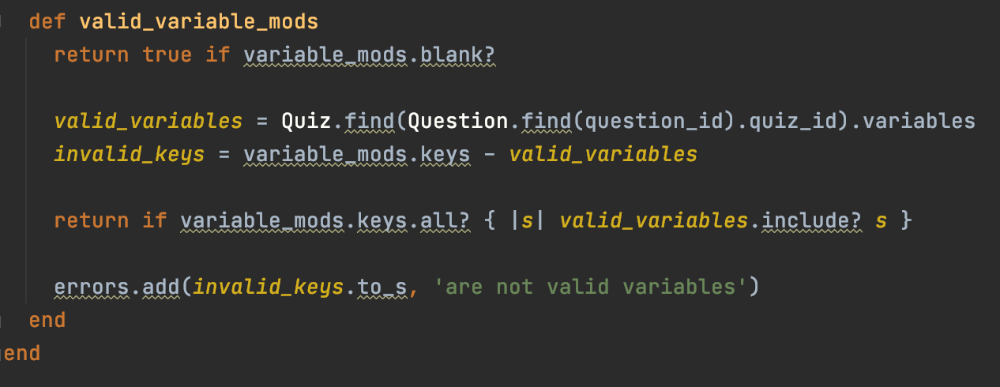

  

  <a href="#project-goals-and-motivation">Introduction & Motivation</a> •
  <a href="#key-features">Key Features</a> •
  <a href="#how-to-use">How To Use</a> •
  <a href="#installation">Installation</a> •
  <a href="#api-reference">API Reference</a> •
  <a href="#credit-and-licence">Credit and Licence</a> •
   

## Project Goals and Motivation

This repository holds the online platform ISPP. Its purpose as a platform is to provide the creation and taking of interactive assessments with added complexities such as concurrent variables and branching paths for a more in-depth assessment.

This project is created by the [Legal Innovation Lab Wales](https://legaltech.wales/) for purposes of creating a platform for charities/organisations to easily create interactive assessment tools to simulate situations and assessments. Such as interview scenarios, Conversation monitoring and life scenarios.

## Key Features

•Free Linking Questions

 

ISPP supports free linking questions which can be used to create and simulate scenarios that are more directly in line with modern conversation. Different answers can be linked to branching questions to allow pathways and a more complex flow. Allowing users to have a more personal assesment.

•Extensive variable customisation

 

Each assement can have adjastent variables tagged along with it. These variables are fully customisable to each individual quiz. Allowing assements of different areas such as complience, understanding, health to run alongside the quiz. This as a result can lead to assements showcasing users strongpoints and areas lacking based of their answers. 

## Tech/framework used
The core technologies used for this project are:
* Ruby. (2.7.2) With Rails (6.1.0) webpacker (4.3.0), 

* React. 17.0.1, React router & Bootstrap for styling the front end components

* HTML, CSS + JS. All HTML, CSS and JS

## How to use

## Installation
Check the package.json for dependencies

Build the application from the project root folder

``bundle install``

Run the application

``rails -s``

You might have to 

``but you might have to run:
rails db:drop
rails db:create
rails db:migrate
rails db:seed``

You should now be able to view the main web page at 

``http://localhost:3000``

## API Reference

Coming soon

## Tests
Coming soon

## Credits and licence
[Legal Innovation Lab Wales Developer Team](https://legaltech.wales/)
